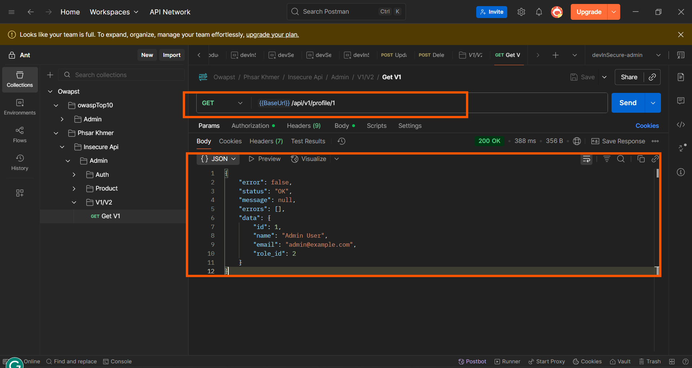

# OWASP API Security Top 10 – Vulnerabilities with Examples
A comprehensive guide covering the most critical API security vulnerabilities with practical examples and Laravel-specific solutions.
Table of Contents

1. Broken Object Level Authorization (BOLA)
2. Broken User Authentication
3. Excessive Data Exposure
4. Lack of Resources & Rate Limiting
5. Broken Function Level Authorization
6. Mass Assignment
7. Security Misconfiguration
8. Injection Attacks
9. Improper Asset Management
10. Insufficient Logging & Monitoring

## 1. Broken Object Level Authorization (BOLA)


-- Failures in this mechanism typically lead to unauthorized information disclosure, modification, or destruction of all data.
<br/>
-- Example: A user can access and modify another user's data by manipulating the URL.

1. **Test**: Try accessing another user's resource by changing the ID. When a user is allowed to access an object (like a user profile or order) just by changing the ID in a request URL or parameter — without verifying whether the user has permission to access that object 

2. **Example Attack**

   1. `GET /api/users/19/profile` ← owner
   2. `GET /api/users/20/profile` ← another user's

      **The issue:**
      When a user login with an account that has id = 19, they are able to access not only their own profile but also the profile of other users, such as user with id = 20 to get information.

   **Similarly:**

   1. `GET /api/users/19/orders` ← owner
   2. `GET /api/users/19/wishlist` – This should return only the logged-in user's wishlist (e.g., their favorite products or categories).
   3. `GET /api/users/20/wishlist` – This incorrectly allows the logged-in user (with id = 19) to access another user's wishlist.

3. **Expected Fix: The Solutions**

   - The backend should verify that the user_id in the request matches the auth_user_id (the ID of the authenticated user)
   - This can be fixed using Laravel Sanctum, Laravel Passport, or JWT by creating a middleware that:
     - Requires the user to be logged in (authenticated)
     - After Logged Checks that the user_id in the request matches the authenticated user's ID, allowing users to access only their own profile or related resources.
     - And have two ways can do 
        - 1. user without id requested param and 
        - 2. user with id requested param
   - Avoid Direct Object References
     - Use indirect references (e.g., hashed IDs, UUIDs) when possible, though this is not a substitute for authorization.
     - A UUID (Universally Unique Identifier), also sometimes called a GUID (Globally Unique Identifier), is a 128-bit label used to uniquely identify information in computer systems.
        - Using in  laravel -> Migration
            ```
                Schema::create('users', function (Blueprint $table) {
                    $table->uuid('id')->primary();
                    $table->uuid('role_id');
                    $table->timestamps();
                });
            ```
        - Add into model
            ```
                use Illuminate\Support\Str;
                protected static function boot()
                {
                    parent::boot();
                    static::creating(function ($model) {
                        $model->id = (string) Str::uuid();
                    });
                }
            ```
     - Using Hashed IDs
        ```
        composer require vinkla/hashids
        ```
        ```
        php artisan vendor:publish --provider="Vinkla\Hashids\HashidsServiceProvider"
        ```
        ```
        $hash = Hashids::encode(123); // e.g. "NkK9"
        $id = Hashids::decode('NkK9'); // [123]
        GET /api/profile/NkK9
        ```

   **Login**
   

   **non secure**
   

   **secure**
   

   **Or can use the same id in the route (e.g. /profile/{id}), but must check that the requested id matches the authenticated user's ID in the backend.**

   

---

## 2. Broken User Authentication


-- Attackers can gain complete control of other users' accounts in the system, read their personal data, and perform sensitive actions on their behalf. Systems are unlikely to be able to distinguish attackers' actions from legitimate user ones.

 - To Prevent Broken Authentication
  - Strong Password Policy
  - Rate Limiting & Account Lockout
   - Lock account after 5–10 failed attempts
   - Use tools like Laravel Throttle, Brute Force Prevention Middleware, or Cloudflare Rate Limiting
   - Where possible, the user-supplied password should be compared to the stored password hash using a secure password comparison function provided by the language or framework, such as the password_verify() function in PHP.

- **Example**:
  1. **Test**: Try using a weak token or a missing token.
     
     ```http
     POST /api/user/data
     Header: Authorization: Bearer abc123 ← test if this is accepted
     ```
     
     in this case missing on not set middleware in route
     
     ```php
     Route::post('/user/data', [UserController::class, 'data']);
     ```
     
     **solution**
     
     ```php
     Route::get('/secure', [UserController::class, 'getProfileSecure'])->middleware('isLoggin');
     ```

  2. **Test**: Try using a weak password
     
     ```http
     POST /api/auth/register
     Body: { "username": "admin", "password": "123456" }
     ```
     
     in this case password validation is not set

     example:
     ```php
     $validator = Validator::make($req->all(), ['password' => 'required|string',]);
     ```
     
     
     

     **solution**
     
     example validate form when user register:
     ```php
     $validator = Validator::make($req->all(), [
         'password' => [
             'required',
             'string',
             'min:8',
             'regex:/[a-z]/',
             'regex:/[A-Z]/',
             'regex:/[0-9]/',
             'regex:/[@$!%*?&#]/',
             'confirmed'
         ],
     ]);
     ```

     
     
     

  3. **Test**: Try using Secure the Login Route.
     - Throttle requests to avoid brute force
     - Validate credentials strictly
     - Use rate limiting (Laravel built-in):
     
     in the case not set rating limit on request endpoint login
     
     example:
     ```php
     Route::post('/login', [UserController::class, 'login']);
     ```
     

     **solution**
     
     example:
     ```php
     Route::middleware('throttle:daily-limit')->post('/login', [UserController::class, 'loginSecure']);
     ```
     

  4. **Test**: Doesn't generate a secret key but uses a custom secret key
     - To fix: Use a secure secret key by commands in laravel:
       ```bash
       composer require tymon/jwt-auth
       php artisan vendor:publish --provider="Tymon\JWTAuth\Providers\LaravelServiceProvider"
       php artisan jwt:secret
       php artisan config:clear
       ```
     - Example Attacks
       ```bash
       command : hashcat -a 0 -m 16500 token.txt jwt.secrets.list
       wordList : https://github.com/wallarm/jwt-secrets/tree/master
       ```
       

  5. **Test**: Doesn't validate the JWT expiration date.
     - **Problems with Non-Expiring JWTs**
       - **Token Theft Risk**
         If someone steals the token (e.g. from local storage, logs, intercepted traffic), and the token never expires, they can access the system forever without re-authentication.
       - **No Revocation**
         - JWTs are stateless — the server doesn't store them. That means:
         -  can't invalidate a token after issuing it.
         - Even if a user logs out, the token still works unless it's manually blacklisted.
       - **Brute Force Vulnerability**
         - Access r system without login
     - **Solution**
       - in .env
         ```env
         JWT_TTL=120   //120 = 2h
         ```
       - in config/jwt.php
         ```php
         'ttl' => env('JWT_TTL', 60), or  'ttl' => (int) env('JWT_TTL', 60),
         ```
       - command:
         ```bash
         php artisan config:clear
         php artisan cache:clear
         php artisan config:cache
         ```

   - **Test**: Doesn't validate the JWT expiration date.
   - **Expected Fix**: Tokens should expire, be signed securely, and verified on each request.

---

## 3. Excessive Data Exposure


-- Exploitation of Excessive Data Exposure is simple, and is usually performed by sniffing the traffic to analyze the API responses, looking for sensitive data exposure that should not be returned to the user. <br/>
-- Excessive Data Exposure commonly leads to exposure of sensitive data.


1. **Test**: Check if sensitive data is returned.

2. **Example Response**:

   

   - Issue: we are working on product id, name, title, and created_at but why return creator?

3. **Expected Fix in this case**: 
    - in Laravel—especially when using select or selectRaw thats want to only select the columns truly need and avoid returning entire models unnecessarily.
    - Never return full Eloquent models directly (return $model)
    - Avoid exposing sensitive fields (e.g. password, tokens, internal IDs)
    - Always use API resources or DTOs (Data Transfer Objects)
    - Consider using transformers or presenters for large datasets
    -  Only return needed fields in responses.
   - to

   

   

---
## 4. Lack of Resources & Rate Limiting


-- Exploitation requires simple API requests. No authentication is required. Multiple concurrent requests can be performed from a single local computer or by using cloud computing resources.
-- Exploitation may lead to DoS, making the API unresponsive or even unavailable.
-- This vulnerability occurs when an API does not impose restrictions on the number or size of requests a client can make, which can lead to:
    ```
    Denial of Service (DoS)
    Server overload
    Brute-force attacks
    Abuse of API functionality (e.g., enumeration attacks)
    ```

    -- issue from 
```
No Rate Limiting on Login Endpoint:
    Allows brute force or credential stuffing attacks
No Limit on Search Results:
    A user sends a query and retrieves 1 million records, crashing the system or exposing data.
No Upload Size Restriction:
    A user uploads a 5GB file, overloading disk or memory.
No Concurrent Session Control:
    One user opens 500 parallel sessions to over-consume bandwidth.
```

1. **Test**: Send many requests quickly.

2. **Example**:
   ```bash
   for i in {1..100}; do curl http://api.test.com/login; done
   ```
   - not set limit rating

   

   - write python script to attacks like ddos

   

   ```json
   {
       "attack_summary": {
           "target_url": "http://192.168.18.53:8000/api/view/product",
           "attack_date": "2025-07-23T00:35:12.551121",
           "total_attacks": 214,
           "successful_attacks": 214,
           "rate_limited_attacks": 0,
           "server_errors": 0,
           "attack_duration": 115.3333535194397
       },
       "security_assessment": {
           "status": "[CRITICAL] CRITICALLY VULNERABLE",
           "risk_level": "CRITICAL",
           "rate_limit_effectiveness": 0.0,
           "success_rate": 1.0,
           "server_stability": 1.0
       },
       "attack_type_breakdown": {
           "API_SCRAPING": {
           "total_requests": 214,
           "success_rate": 1.0,
           "avg_response_time": 1635.4677699436652
           }
       },
       "recommendations": [
           "[CRITICAL] Implement aggressive rate limiting (Laravel throttle middleware)",
           "[CONFIG] Set strict limits: 60 requests/minute per IP for API endpoints",
           "[SECURITY] Implement progressive rate limiting with exponential backoff",
           "[BLOCKING] Add IP blocking for repeated violations (fail2ban style)",
           "[MONITORING] Deploy real-time monitoring and alerting for attack patterns",
           "[WAF] Deploy Web Application Firewall (WAF) with API protection",
           "[DETECTION] Implement behavioral analysis for attack detection",
           "[TESTING] Regular security testing and penetration testing",
           "[RESPONSE] Set up incident response procedures for API attacks",
           "[AUTH] Consider API authentication and authorization improvements"
       ]
   }
   ```

   - If a login endpoint does not implement rate limiting, it becomes highly vulnerable to brute-force attacks — where an attacker tries a huge number of password combinations to gain access.

   

   - without middleware

   ```php
   Route::post('/login', [UserController::class, 'loginSecure']);
   ```

3. **Expected Fix**: Apply rate limits per IP or user token
   - set limit rating
   - Auth endpoints : Lower limits (e.g., 5–10/min)
   -  General APIs : Medium limits (e.g., 60/min)
   - Abuse-prone actions : Custom limits, CAPTCHA, lockouts
   - Monitor : Use logs and alerts for spikes

   
   

   - write python script to attacks like ddos

   

   ```json
   "attack_summary": {
       "target_url": "http://192.168.18.53:8000/api/view/product",
       "attack_date": "2025-07-23T01:03:18.883586",
       "total_attacks": 336,
       "successful_attacks": 120,
       "rate_limited_attacks": 216,
       "server_errors": 0,
       "attack_duration": 138.8990457057953
   },
   "security_assessment": {
       "status": "[WARNING] MODERATELY PROTECTED",
       "risk_level": "MEDIUM",
       "rate_limit_effectiveness": 0.6428571428571429,
       "success_rate": 0.35714285714285715,
       "server_stability": 1.0
   },
   "attack_type_breakdown": {
       "API_SCRAPING": {
       "total_requests": 336,
       "success_rate": 0.35714285714285715,
       "avg_response_time": 1198.6441626435235
       }
   }
   ```

   - with middleware for check and block ip
   ```php
   Route::post('/login', [UserController::class, 'loginSecure'])->middleware(['block-malicious-ips']);
   ```
   

   - status 429 : thats mean "Too Many Requests", indicates that a client has sent too many requests to a server in a given amount of time, exceeding the server's rate limits. Essentially, the server is telling the client to slow down. This is a common mechanism used to prevent abuse or overloading of servers and APIs.


--
## 5. Broken Function Level Authorization


-- Exploitation requires the attacker to send legitimate API calls to an API endpoint that they should not have access to as anonymous users or regular, non-privileged users. Exposed endpoints will be easily exploited.
-- Such flaws allow attackers to access unauthorized functionality. Administrative functions are key targets for this type of attack and may lead to data disclosure, data loss, or data corruption. Ultimately, it may lead to service disruption.

   **Issue:**
   - **No middleware to check role permissions**
     - Routes (e.g., DELETE /api/view/product/{id}) are exposed without checking if the user has permission (e.g., is an admin).
   - **Returning routes or data that shouldn't be accessible**
     - Sensitive routes are accessible to all authenticated users or even unauthenticated users.
   - **Missing role-based logic inside controllers**
     - Example: No checks inside ProductController@destroy to confirm if the user is allowed to delete.

1. **Test**: Use a lower-permission token to access admin actions.
2. **Example**
   ```http
   DELETE /api/admin/delete-user/123 ← with normal user token
   ```
   

   

   


   **Example**
   ```php
   Route::prefix('view')->group(function () {
       Route::prefix('product')->group(function () {
           Route::post('', [ProductController::class, 'store']);
           Route::get('', [ProductController::class, 'index']);
           Route::get('/{id}', [ProductController::class, 'show']);
           Route::put('/{id}', [ProductController::class, 'update']);
           Route::delete('/{id}', [ProductController::class, 'destroy']);
       });
   });
   ```

3. **Expected Fix**: Check user roles/permissions in the backend.
   - **1. Use Middleware to Enforce Role Permissions**
     - Create a middleware to check for role
       ```bash
       php artisan make:middleware jwtAuth
       ```

       ```php
       Route::prefix('view')->group(function () {
           Route::prefix('product')->group(function () {
               Route::get('', [ProductController::class, 'index']);
               Route::get('/{id}', [ProductController::class, 'show']);

               Route::middleware('isLoggin')->post('', [ProductController::class, 'store']);
               Route::middleware('jwtAuth')->put('/{id}', [ProductController::class, 'update']);
               Route::middleware('jwtAuth')->delete('/{id}', [ProductController::class, 'destroy']);
           });
       });
       ```

   - **2. Restrict Sensitive Routes**
     - Remove or disable routes  don't want exposed
     - If in frontend display list of products and product details only

       ```php
       Route::prefix('view')->group(function () {
           Route::prefix('product')->group(function () {
               Route::get('', [ProductController::class, 'index']);
               Route::get('/{id}', [ProductController::class, 'show']);

               // Route::middleware('isLoggin')->post('', [ProductController::class, 'store']);
               // Route::middleware('jwtAuth')->put('/{id}', [ProductController::class, 'update']);
               // Route::middleware('jwtAuth')->delete('/{id}', [ProductController::class, 'destroy']);
           });
       });
       ```

   - **3. Add In-Controller Authorization Logic (optional fallback)**
     - In case someone bypasses middleware
     - Example in update or delete
       ```php
       $user = UserService::getAuthUser();
       $product = Product::where('user_id', $user->id)->find($id);
       ```

   

---

## 6. Mass Assignment


- Exploitation of mass assignment is easier in APIs, since by design they expose the underlying implementation of the application along with the properties' names.
- Exploitation may lead to privilege escalation, data tampering, bypass of security mechanisms, and more.
- Why is Mass Assignment a Security Risk?
- If 're not careful, attackers can submit unexpected fields, like is_admin, role, or balance, and elevate privileges or manipulate data.

1. **Test**: Try sending extra parameters in the request.

2. **Example**:
   ```json
   {
      "username": "staff",
      "isAdmin": true
   }
   ```

3. **Expected Fix**: Use whitelisting to control which fields can be updated.
    - Use $fillable (whitelist)
    - Use $guarded (blacklist)
    - Never trust $request->all() blindly: Prefer whitelist over blacklist
    - Validate input : Use validated or filtered input
    - Always use validation before model assignment : Always use validation before model assignment
    - Avoid assigning user_id, role, or is_admin from request : Set them server-side 
---

## 7. Security Misconfiguration
-- A security misconfiguration is a common category of security issue in software and systems. It occurs when a system, application, or service is not properly configured, leaving it vulnerable to attacks or unauthorized access.<br/>
-- The threat vectors can vary quite a lot here, it can range from not encrypting traffic between servers to having a shadow API on the network that is not maintained and poorly configured to allow for SSH access.<br/>
-- This vulnerability might lead to an attacker being able to fully take over all the infrastructure even so this is an issue that should be handled with great care.<br/>
1. **Test**: Check for
   - Stack traces in error
   - Missing security headers
   - Open CORS policy (`Access-Control-Allow-Origin: *`)
   - Missing X-Frame-Options : App can be embedded in malicious iframes (clickjacking)
   - Missing X-Content-Type-Options : Browser may interpret script files as executable
   - Exposing X-Powered-By: PHP : Reveals framework — helps attackers
   - Using default Laravel .env in production : Could expose app secrets
   - No rate limiting on login : Brute-force risk

   Exmaple of Security Headers in laravel api <br/>
   - run api and try to test with command
        ```
        curl -I yout_domain_api
        eg i run in my local. curl -I http://127.0.0.1:8000
        ```

   


2. **Fix**: Sanitize errors, use CSP headers, and configure CORS strictly.
    - How to Avoid Security Misconfiguration in Laravel
     - Set essential headers via middleware
     - Set APP_ENV=production and APP_DEBUG=false in .env
     - Hide stack traces and error messages
     - Disable default routes/controllers if don’t use it
     - Remove unused packages (especially debug/testing)
     - Disable directory listing (in web server)
     - Secure cookies (HttpOnly, Secure, SameSite)
     - Regularly audit and update dependencies

    Exmaple to protect of Security Headers in laravel api <br/>
   - create new middleware 
        ```php artisan make:middleware SecurityHeaders
        ```
        ``` add to SecurityHeaders middleware file
         public function handle(Request $request, Closure $next)
        {
            $response = $next($request);
            $response->headers->set('X-Frame-Options', 'SAMEORIGIN');
            $response->headers->set('X-XSS-Protection', '1; mode=block');
            $response->headers->set('X-Content-Type-Options', 'nosniff');
            $response->headers->set('Content-Security-Policy', "default-src 'self';");
            $response->headers->set('Referrer-Policy', 'no-referrer');
            $response->headers->set('Permissions-Policy', 'camera=(), microphone=(), geolocation=()');
            return $response;
        }
        ```
        ```add middleware to boostrapt/app.php (for laravel 11, or laravel 10 can use with kernel.php)
                ->withMiddleware(function (Middleware $middleware) {
                $middleware->web(append: [
                    SecurityHeaders::class,
                ]);
            })
        ```

   - and retry run api to test again with command
        ```
        curl -I yout_domain_api
        eg i run in my local. curl -I http://127.0.0.1:8000
        ```
    
---

## 8. Injection (SQL, NoSQL, Command Injection)


- Attackers will feed the API with malicious data through whatever injection vectors are available (e.g., direct input, parameters, integrated services, etc.), expecting it to be sent to an interpreter.
- Injection can lead to information disclosure and data loss. It may also lead to DoS, or complete host takeover.
- What is Injection?
   - Injection occurs when:
    - The API takes untrusted data (e.g., from user input),
    - Sends it to an interpreter (like a SQL engine, NoSQL query, or shell),
    - And the interpreter executes the commands without proper sanitization.

1. **Test**: Try sending injection payloads.

2. **Example**
   ```json
   {
      "username": "admin' OR '1'='1",
      "password": "anything"
   }
   ```
   
   Here is an example this function is vulnerable to SQL Injection because it directly inserts user input into a raw SQL query without any sanitization or binding.
   
   ```php
   public function getProfileCanInject(Request $req, $id)
   {
       $user = DB::select("SELECT id, name, email FROM users WHERE id = $id LIMIT 1");
       if ($user) {
           $role = DB::select("SELECT role_id FROM user_roles WHERE user_id = $id LIMIT 1");
           $user[0]->role_id = $role[0]->role_id ?? null;
       }
       return ApiResponse::JsonResult($user[0] ?? null);
   }
   ```

   on code in line 
   ```php
   $user = DB::select("SELECT id, name, email FROM users WHERE id = $id LIMIT 1");
   ``` 
   it also result in the query sql like this:
   ```sql
   SELECT id, name, email FROM users WHERE id = 1 OR 1=1 LIMIT 1
   ```

   
   

     ```php
    NoSQL Injection (e.g., MongoDB)
    $input = $request->input('email');
    User::where('email', $input)->first(); // if $input = ['\$ne' => null], bypasses auth
   ```

3. **Expected Fix**: Use prepared statements and input validation
   - How to fix it securely
    - Use parameter binding (prepared statements) instead
    - SQL Injection: Use Eloquent or parameter binding in raw queries
    - NoSQL Injection: Validate input strictly before queries
    - Command Injection: Avoid shell commands; use Laravel helpers
    - Global Input: Sanitization	Use Laravel's Validator or Form Requests
    - Logging: Log suspicious inputs or patterns
    - WAF or IDS	Use ModSecurity, Cloudflare, or intrusion detection tools

   ```php
   $user = DB::select("SELECT id, name, email FROM users WHERE id = ? LIMIT 1", [$id]);
   ```
   -- Or, even better, use Eloquent:
   ```php
   public function getProfile(Request $req, $id)
   {
       // $authUser = UserService::getAuthUser();
       // $id = $authUser->id;
       $user = User::selectRaw('id, name,email')->find($id);
       if ($user)
           $user->role_id = UserRole::where('user_id', $id)->take(1)->value('role_id');
       return ApiResponse::JsonResult($user);
   }
   ```
   

    ```sql
    $input = $request->input('email');
    User::where('email', $input)->first(); 
    ```
---

## 9. Improper Asset Management


-- Improper asset management refers to exposing non-production endpoints (e.g., staging, debug routes, old versions) or failing to track exposed APIs, which attackers can exploit to access sensitive data or functionality.

1. **Test**: Discover unused or old versions of APIs.
   
   **How Attackers Discover These**
   - Directory Fuzzing: Using tools like ffuf, dirsearch, gobuster
   - Crawling Swagger / Postman / Insomnia shared docs
   - GitHub Recon: Searching for .env, .json, .yml, or .http files
   - Wayback Machine: Finding old API endpoints or docs
   - Shodan or Censys: Discovering exposed staging/dev systems

2. ```
   /api/v1/users
   /api/v2/users ← legacy, still active?
   ```
   
   **example**
   ```php
   Route::prefix('v1')->group(function () {
       Route::prefix('profile')->group(function () {
           Route::get('/{id}', [ProfileController::class, 'getProfile']);
       });
   });
   ```
   
   

3. **Fix**: Keep inventory and disable old or unmaintained endpoints.
   
   **Defense Strategies**
   - Inventory r APIs: Use API gateways or asset management tools.
   - Restrict access to non-production environments (use auth, IP whitelisting).
   - Remove deprecated/legacy endpoints.
   - Version management: Make sure old versions are retired or secured.
   - Don't expose API documentation publicly.
   - Sanitize error messages in production.
   - Regularly scan for exposed endpoints and misconfigurations.

   - if dont use it remove the old version or dont need remove just create middleware to check
   - can create middleware for old endpoint api (check authenticator)
   
   ```php
   Route::prefix('v1')->middleware('isLoggin')->group(function () {
       Route::prefix('profile')->group(function () {
           Route::put('/{id}', [ProfileController::class, 'update']);
           Route::delete('/{id}', [ProfileController::class, 'delete']);
           Route::get('/{id}', [ProfileController::class, 'getProfile']);
       });
   });
   ```

   **or**

   ```php
   // Route::prefix('v1')->middleware('isLoggin')->group(function () {
   //     Route::prefix('profile')->group(function () {
   //         Route::put('/{id}', [ProfileController::class, 'update']);
   //         Route::delete('/{id}', [ProfileController::class, 'delete']);
   //         Route::get('/{id}', [ProfileController::class, 'getProfile']);
   //     });
   // });
   ```
   
   

---

## 10. Insufficient Logging & Monitoring


-- Attackers take advantage of lack of logging and monitoring to abuse systems without being noticed.
-- Without visibility over on-going malicious activities, attackers have plenty of time to fully compromise systems.
-- It refers to the lack of proper logging and alerting mechanisms, which makes it difficult to detect, respond to, or even understand the impact of security breaches or suspicious activity.

**Why Is It Dangerous?**
- Without logging and monitoring:
  - Attacks may go undetected for a long time (e.g., months).
  - It becomes hard to investigate and respond to breaches.
  - Forensics and root cause analysis are almost impossible.
  - Compliance violations may occur (e.g., GDPR, HIPAA).
    
1. **Test**: Trigger errors or failed login attempts.
   
   **example of code**
   ```
    public function login(Request $req)
    {
        $validate = Validator::make($req->only(['email', 'password']), [
            'email' => 'required|string',
            'password' => 'required|string|min:6|max:16',
        ]);
        if ($validate->fails())
            return ApiResponse::ValidateFail($validate->errors()->all());
        $credentials = $validate->validated();
        $account = strtolower($credentials['email']);
        $password = $credentials['password'];
        $user = User::where(function ($q) use ($account) {
            $q->whereRaw('LOWER(email) = ?', [$account])
                ->orWhereRaw('LOWER(name) = ?', [$account]);
        })->first();
        if (!$user || !password_verify($password, $user->password))
            return ApiResponse::NotFound('Invalid email or password');
        if (!$token = JWTAuth::fromUser($user))
            return ApiResponse::ValidateFail('Could not create token');
        $user->roles = UserService::getRolesByUsers($user->id);
        $data = (object) [
            'email' => $user->email,
            'name' => $user->name,
            'roles' => $user->roles,
            'id' => $user->id,
            'token' => $token,
        ];
        return ApiResponse::JsonResult($data, 'Login successful.');
    }
    ```
   

2. **Fix**: Ensure such events are logged and alerting is in place
    **example of code**
    ```
        public function loginSecure(Request $req)
        {
            $validate = Validator::make($req->only(['email', 'password']), [
                'email' => 'required|string',
                'password' => 'required|string|min:6|max:16',
            ]);
            if ($validate->fails()) {
                Log::warning('Login validation failed', [
                    'email' => $req->input('email'),
                    'ip' => $req->ip(),
                    'errors' => $validate->errors()->all()
                ]);
                return ApiResponse::ValidateFail($validate->errors()->all());
            }
            $credentials = $validate->validated();
            $account = strtolower($credentials['email']);
            $password = $credentials['password'];
            $user = User::where(function ($q) use ($account) {
                $q->whereRaw('LOWER(email) = ?', [$account])
                    ->orWhereRaw('LOWER(name) = ?', [$account]);
            })->first();

            if (!$user || !password_verify($password, $user->password)) {
                Log::warning('Failed login attempt', [
                    'email_or_name' => $account,
                    'ip' => $req->ip(),
                    'time' => now()
                ]);
                return ApiResponse::NotFound('Invalid email or password');
            }
            if (!$token = JWTAuth::fromUser($user)) {
                Log::error('Token creation failed', [
                    'user_id' => $user->id,
                    'email' => $user->email,
                    'ip' => $req->ip(),
                    'time' => now()
                ]);
                return ApiResponse::ValidateFail('Could not create token');
            }
            Log::info('User login successful', [
                'user_id' => $user->id,
                'email' => $user->email,
                'ip' => $req->ip(),
                'time' => now()
            ]);
            $user->roles = UserService::getRolesByUsers($user->id);
            $data = (object) [
                'email' => $user->email,
                'name' => $user->name,
                'roles' => $user->roles,
                'id' => $user->id,
                'token' => $token,
            ];
            return ApiResponse::JsonResult($data, 'Login successful.');
        }
    ```
   
   
   - **Logging**: Log all authentication attempts, access control failures, permission changes, and errors.
   - **Monitoring**: Use tools like SIEM (Security Information and Event Management) to monitor logs and detect anomalies.
   - **Alerting**: Set up real-time alerts for critical actions (e.g., suspicious login, data export).
   - **Retention**: Store logs securely and retain them based on legal and operational needs.
   - **Access Control**: Protect logs from unauthorized access and tampering.
   - **Review**: Conduct periodic audits and analysis of log data.
   - **Correlation**: Correlate logs across services and layers (app, API, database, OS, etc.).
