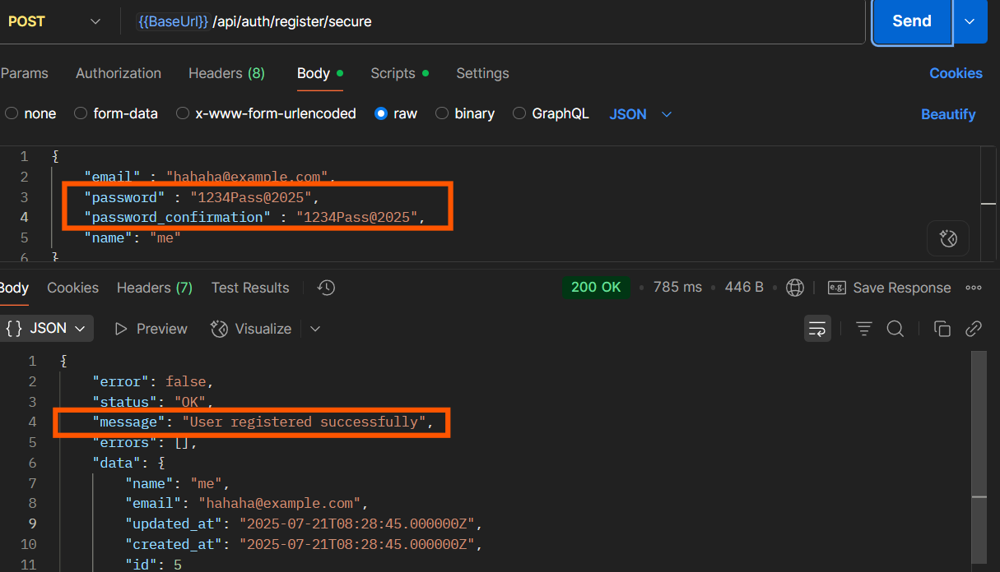

OWASP API Security Top 10 – Vulnerabilities with Examples

1. Broken Object Level Authorization (BOLA)

    

    -- Failures in this mechanism typically lead to unauthorized information disclosure, modification, or destruction of all data.
    -- Example: A user can access and modify another user's data by manipulating the URL.

    1. **Test**: Try accessing another user's resource by changing the ID.

    2. Example Attack

        1. GET /api/users/19/profile ← your own
        2. GET /api/users/20/profile ← another user's

            The issue:
            When a user login with an account that has id = 19, they are able to access not only their own profile but also the profile of other users, such as user with id = 20 to get information.

        Similarly:

        1. GET /api/users/19/orders ← your own
        1. GET /api/users/19/wishlist – This should return only the logged-in user's wishlist (e.g., their favorite  
           products or categories).
        1. GET /api/users/20/wishlist – This incorrectly allows the logged-in user (with id = 19) to access another user's
           wishlist.

    3. **Expected Fix: The** Solutions

        - The backend should verify that the user_id in the request matches the auth_user_id (the ID of the authenticated
          user)
          This can be fixed using Laravel Sanctum, Laravel Passport, or JWT by creating a middleware that: - Requires the user to be logged in (authenticated) - After Logged Checks that the user_id in the request matches the authenticated user's ID, allowing users to access only their own profile or related resources. - And have two ways can do 1. user without id requested and 2. user with id requested

        ..Login
        

        ..non secure
        

        ..secure
        

        ..Or can use the same id in the route (e.g. /profile/{id}), but must check that the requested id matches the authenticated user's ID in the backend.
        

2. Broken User Authentication

    

    -- Attackers can gain complete control of other users’ accounts in the system, read their personal data, and perform sensitive actions on their behalf. Systems are unlikely to be able to distinguish attackers’ actions from legitimate user ones.

    1. **Example**: Attack

        1. **Test**: Try using a weak token or a missing token. 
            POST /api/user/data 
            Header: Authorization: Bearer abc123 ← test if this is accepted 
            in this case missing on not set middleware in route 
                Route::post('/user/data', [UserController::class, 'data']); 
            sulotion 
                Route::get('/secure', [UserController::class, 'getProfileSecure'])->middleware('isLoggin');

        2. **Test**: Try using a weak password 
            POST /api/auth/register 
            Body: { "username": "admin", "password": "123456" } 
            in this case password validation is not set 

            example : 
            $validator = Validator::make($req->all(), ['password' => 'required|string',]); 
             
             
            

            sulotion 
            example validate form when user register: 
            $validator = Validator::make($req->all(), [
                'password' => [
                    'required',
                    'string',
                    'min:8',
                    'regex:/[a-z]/',
                    'regex:/[A-Z]/',
                    'regex:/[0-9]/',
                    'regex:/[@$!%*?&#]/',
                    'confirmed'
                ],
            );  

            
            
            
            

        3. **Test**: Try using Secure the Login Route.
            - Throttle requests to avoid brute force
            - Validate credentials strictly
            - Use rate limiting (Laravel built-in):
            in the case not set rating limit on request endpoint login 
            example : 
            Route::post('/login', [UserController::class, 'login']); 
             

            sulotion 
            example : 
            Route::middleware('throttle:daily-limit')->post('/login', [UserController::class, 'loginSecure']); 
            

        4. **Test**: Doesn't generate a secret key but uses a custom secret key
            - To fix: Use a secure secret key by commands in laravel:
                - composer require tymon/jwt-auth
                - php artisan vendor:publish --provider="Tymon\JWTAuth\Providers\LaravelServiceProvider"
                - php artisan jwt:secret
                - php artisan config:clear
            - Example Attacks
                - command : hashcat -a 0 -m 16500 token.txt jwt.secrets.list
                - wordList : https://github.com/wallarm/jwt-secrets/tree/master
                

        5. **Test**: Doesn't validate the JWT expiration date.
            - Problems with Non-Expiring JWTs
                - Token Theft Risk
                        If someone steals the token (e.g. from local storage, logs, intercepted traffic), and the token never expires, they can access the system forever without re-authentication.
                - No Revocation
                    - JWTs are stateless — the server doesn’t store them. That means:
                    - You can’t invalidate a token after issuing it.
                    - Even if a user logs out, the token still works unless it's manually blacklisted.
                - Brute Force Vulnerability
                    - Access your system without login
            - Solution
                - in .env
                    JWT_TTL=120   //120 = 2h
                - in config/jwt.php
                    'ttl' => env('JWT_TTL', 60), or  'ttl' => (int) env('JWT_TTL', 60),
                - command: 
                    - php artisan config:clear
                    - php artisan cache:clear
                    - php artisan config:cache

         5. **Test**: Doesn't validate the JWT expiration date.

    2. **Expected Fix**: Tokens should expire, be signed securely, and verified on each request.

    <h2> 3. Excessive Data Exposure </h2>

    
    
    --Exploitation of Excessive Data Exposure is simple, and is usually performed by sniffing the traffic to analyze the API responses, looking for sensitive data exposure that should not be returned to the user.
    -- Excessive Data Exposure commonly leads to exposure of sensitive data.

    

    1. **Test**: Check if sensitive data is returned.
    2. **Example Response**:
        1.   
             
    
             
             
        - Issue: we are working on  product id, name, title, and created_at but why return creator?
         
         
        2. To fix "Excessive Data Exposure" in Laravel—especially when using select or selectRaw thats want to only select
            the columns truly need and avoid returning entire models unnecessarily.
            - to
             
             
    
                     
                     
    
                     
                     
    **Expected Fix in this case**: Only return needed fields in responses.

4. Lack of Resources & Rate Limiting

    1. **Test**: Send many requests quickly.
    2. Example:
        1. for i in {1..100}; do curl http://api.test.com/login; done
    3. **Expected Fix**: Apply rate limits per IP or user token

5. Broken Function Level Authorization

    1. **Test**: Use a lower-permission token to access admin actions.
    2. Example
        1. DELETE /api/admin/delete-user/123 ← with normal user token
    3. **Expected Fix**: Check user roles/permissions in the backend.

6. Mass Assignment

    1. **Test**: Try sending extra parameters in the request.
    2. **Example**:
        1. {
           "username": "test",
           "isAdmin": true
           }
    3. **Expected Fix**: Use whitelisting to control which fields can be updated.

7. Security Misconfiguration

    1. **Test**: Check for
    2.  - Stack traces in error
        - Missing security headers
        - Open CORS policy (`Access-Control-Allow-Origin: *`)
    3. **Fix**: Sanitize errors, use CSP headers, and configure CORS strictly.

8. Injection (SQL, NoSQL, Command Injection)

    1. **Test**: Try sending injection payloads.
    2. Example
        1. {
           "username": "admin' OR '1'='1",
           "password": "anything"
           }
    3. **Expected Fix**: Use prepared statements and input validation

9. Improper Asset Management

    1. **Test**: Discover unused or old versions of APIs.
    2. /api/v1/users
       /api/v2/users ← legacy, still active?
    3. **Fix**: Keep inventory and disable old or unmaintained endpoints.

10. Insufficient Logging & Monitoring
    1. **Test**: Trigger errors or failed login attempts.
    2. **Fix**: Ensure such events are logged and alerting is in place
